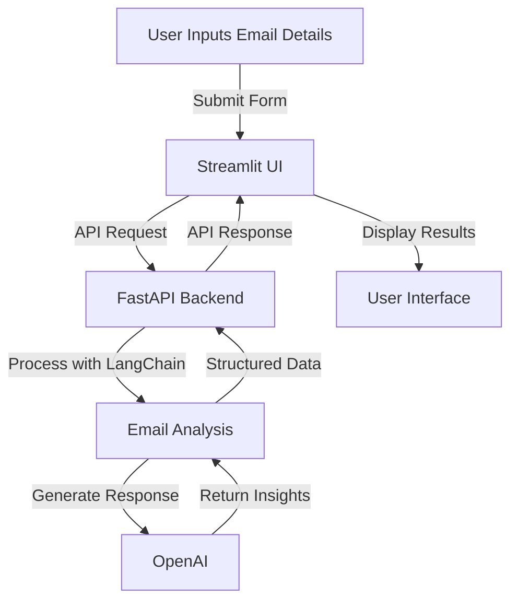

# Email Automation Agent 🚀

[](https://python.org)
[](https://fastapi.tiangolo.com)
[](https://streamlit.io)

An AI-powered email automation system that categorizes emails, generates responses, and prioritizes messages using LangChain and OpenAI.

## 📌 Overview

A two-tier application featuring:
- **Backend**: FastAPI server with LangChain/OpenAI integration
- **Frontend**: Streamlit web interface for email processing
- **AI Features**: Email categorization, response generation, urgency detection

## 🗂️ Project Structure

```sh
langchain-email-automation/
│── backend/  
│   ├── main.py       # FastAPI backend with LangChain  
│── frontend/  
│   ├── app.py        # Streamlit frontend with AI summaries  
│── requirements.txt  # Dependencies  
├── .env          # API keys 
│── README.md         # Project documentation
│── sample_data.txt         # Sample Test Data
```

## ✨ Features

- 📧 Automatic email analysis and classification
- 🤖 AI-generated response suggestions
- 🚨 Urgency prioritization (High/Medium/Low)
- 📨 Draft response management
- 🔄 Response regeneration capability
- 🛠️ Extensible architecture for custom integrations

## 🔄 Workflow Diagram



## 🛠️ Installation

```bash
# Clone repository
git clone https://github.com/haseebahmed49/langchain-email-automation.git
cd langchain-email-automation

# Create virtual environment (recommended)
python3 -m venv venv
source venv/bin/activate  # Linux/Mac
venv\Scripts\activate     # Windows

# Install dependencies
pip install -r requirements.txt
```

## ⚙️ Configuration

Create `.env` file:
```env
OPENAI_API_KEY=your_api_key_here
```

## 🚀 Usage

### Start Backend Server
```bash
uvicorn backend.main:app --reload
```

### Start Frontend Interface
```bash
streamlit run frontend/app.py
```

Access the web interface at `http://localhost:8501`

## 🔧 API Endpoints

| Endpoint | Method | Description |
|----------|--------|-------------|
| `/process-email` | POST | Process email (JSON payload) |

**Request Format:**
```json
{
  "sender": "user@example.com",
  "subject": "Urgent Request",
  "body": "Need immediate assistance..."
}
```

## 🌟 Example Usage

```python
import requests

response = requests.post(
    "http://localhost:8000/process-email",
    json={
        "sender": "client@company.com",
        "subject": "Project Deadline",
        "body": "We need to discuss timeline changes immediately."
    }
)

print(response.json())
```

**Sample Response:**
```json
{
  "category": "urgent",
  "response": "We'll prioritize your request...",
  "urgency": "high"
}
```

## 🧪 Testing

1. **API Testing** (using curl):
```bash
curl -X POST "http://localhost:8000/process-email" \
-H "Content-Type: application/json" \
-d '{"sender":"test@test.com","subject":"Test","body":"Test content"}'
```

2. **Frontend Testing**:
- Access the Streamlit interface
- Fill test email details
- Click "Process Email"

## 📈 Future Enhancements

- [ ] Email sending capabilities
- [ ] User authentication system
- [ ] Email history database
- [ ] Attachment handling
- [ ] Multi-language support
- [ ] Analytics dashboard

## 🤝 Contributing

1. Fork the repository
2. Create your feature branch (`git checkout -b feature/AmazingFeature`)
3. Commit changes (`git commit -m 'Add some AmazingFeature'`)
4. Push to branch (`git push origin feature/AmazingFeature`)
5. Open a Pull Request

## 📜 License

Distributed under the MIT License. See `LICENSE` for more information.

## 📧 Contact

Project Maintainer: [Haseeb Ahmed] - haseebahmed02@gmail.com

Project Link: [https://github.com/haseebahmed49/langchain-email-automation](https://github.com/haseebahmed49/langchain-email-automation)
